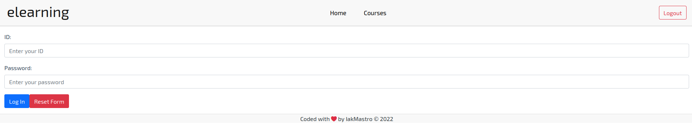
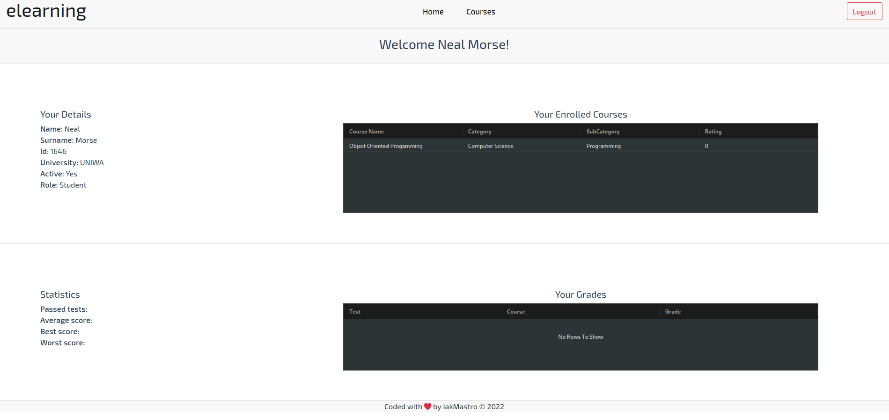
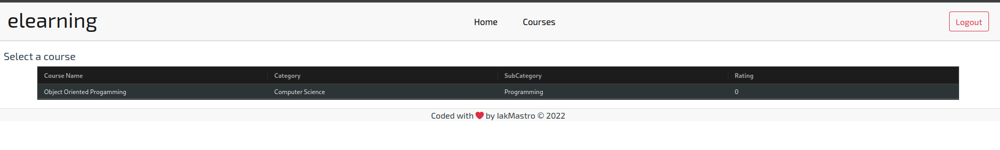
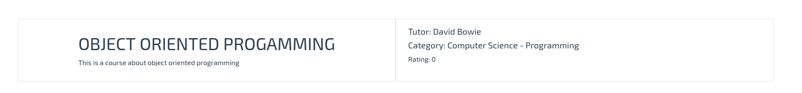
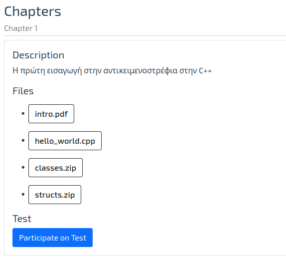
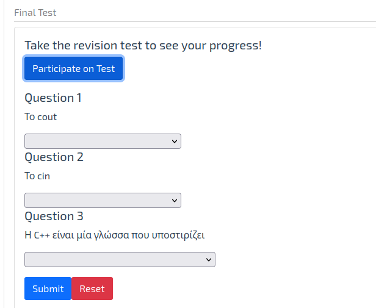

# Πλατφόρμα Ηλεκτρονικής Μάθησης - Εγχειρίδιο Χρήσης Χρήστη

## Σύνδεση

Όταν θα σας σταλθούν τα ακαδημαϊκά σας στοιχεία, πληκτρολογείστε τον αριθμό μητρώου σας και τον κωδικό που θα σας σταλθεί.

## Αρχική Σελίδα

Όταν δείτε αυτή την σελίδα, σημαίνει ότι έχετε συνδεθεί επιτυχώς στο σύστημα.

Η συγκεκριμένη σελίδα έχει δύο σκοπούς:

1. Να σας εμφανίσει τα μαθήματα για τα οποία έχετε γραφτεί στο τρέχον εξάμηνο μαζί με τα στοιχεία σας.
2. Να σας εμφανίσει τις βαθμολογίες σας και τα στατιστικά στοιχεία.

Από αυτή την σελίδα, μπορείτε να κατευθυνθείτε στα μαθήματα τα οποία υπάρχουν στην πλατφόρμα ή στα μαθήματα που έχετε εγγραφεί.

## Κατάλογος Μαθημάτων

Στην συγκεκριμένη σελίδα, σας εμφανίζει όλα τα μαθήματα τα οποία υπάρχουν στο σύστημα. Μπορείτε να επιλέξετε κάποιο κάνοντας κλικ για να δείτε το περιεχόμενο τους.

## Σελίδα μαθήματος

Η σελίδα μαθήματος είναι αρκετά περιπλοκή και είναι χωρισμένη σε τρία τμήματα

### Πρώτο τμήμα: Πληροφορίες μαθήματος

Στο πρώτο τμήμα, σας εμφανίζει πληροφορίες σχετικά με το μάθημα όπως ποιος καθηγητής το διδάσκει και σε ποια κατηγορία ανήκει.

### Δεύτερο τμήμα: Περιεχόμενα Κεφαλαίου

Στο δεύτερο τμήμα, το μάθημα χωρίζεται σε κεφάλαια τα οποία το καθένα έχει ξεχωριστό περιεχόμενο και μπορείτε να κατεβάσετε τα αρχεία τα οποία είναι ανεβασμένα από τον καθηγητή του μαθήματος για να μελετήσετε. Το κάθε κεφάλαιο παρέχει και ένα διαγώνισμα το οποίο μπορείτε να δώσετε για να δείτε την πρόοδο σας κατά την διάρκεια του εξαμήνου

### Τρίτο τμήμα: Τελική Εξέταση

Το τελευταίο τμήμα αποτελεί την τελική σας εξέταση στο μάθημα για να μπορείτε να το περάσετε επιτυχώς!

